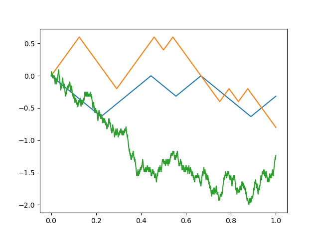

# CQF
Certificate in Quantitative Finance (2019 July Cohort)

---

## Module 1 - Assignments
***

### General/binomial_model
Replicates Excel-version from Module 1 Lesson 2.

### General/brownian_motion
Replicates example of coin toss with decreasing time steps from Module 1 Lesson 3.

